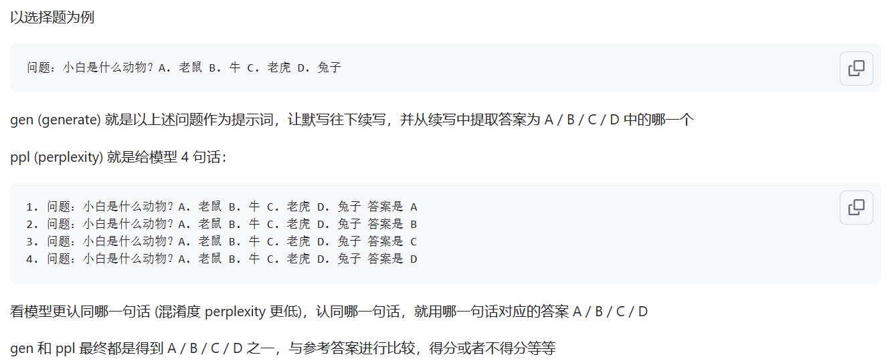

# Tiny LLM zh

## 1.简介

本项目旨在构建一个小参数量的中文语言大模型，用于快速入门学习大模型相关知识，如果此项目对你有用，可以点一下start，谢谢！

模型架构：整体模型架构采用开源通用架构，包括：RMSNorm，RoPE，MHA等

实现细节：实现大模型两阶段训练及后续人类对齐，即：分词(Tokenizer) -> 预训练(PTM) -> 指令微调(SFT) -> 人类对齐(RLHF, DPO) -> 测评 -> 量化 -> 部署。

项目已部署，可以在如下网站上体验。

- [ModeScope Tiny LLM](https://www.modelscope.cn/studios/wdndev/tiny_llm_92m_demo/summary)

项目特点：

- 公开全部数据及代码，包括预训练数据，tokenizer等；（[Tiny LLM Datasets](doc/datasets_download.md)）
- 走通大模型整个流程：分词(Tokenizer) -> 预训练(PTM) -> 指令微调(SFT) -> 人类对齐(RLHF, DPO) -> 测评 -> 部署；
- 公开预训练token 42B，SFT数据400w条，RL数据 17w条；
- 训练 Tokenizer：10G 中文百科文本训练 20K 中文词表，与 Llama2 词表合并，构建Tiny LLM词表；
- 使用 Transformers deepspeed 进行训练，支持多机多卡，支持 Zero 等优化技术；
- 所有代码 `Bash` 脚本启动，支持不同大小的模型，如16m, 42m, 92m, 210m, 440m等；
- 支持 MoE 架构，在 [tiny_llm_moe](https://github.com/wdndev/tiny-llm-zh/tree/tiny_llm_moe) 支持最新共享专家，平衡专家等技术；
- 支持 vLLM 推理框架；
- 支持 llama.cpp 推理框架；


本项目主要有三个分支，推荐学习 主分支，具体区别如下：

- [llama2_torch](https://github.com/wdndev/tiny-llm-zh/tree/llama2_torch) ： 模型架构采用原版 Llama2 架构，只是将部分的输入输出修改为适合训练的格式；
- `main`   `tiny_llm` ： 对齐开源社区模型，使用Transformers库构建底层模型，也使用Transformers库进行多卡多机训练；
- [tiny_llm_moe](https://github.com/wdndev/tiny-llm-zh/tree/tiny_llm_moe) ： 在`tiny_llm`的基础上，修改 `MLP`层为MoE模型，使用Transformers库进行多卡多机训练。

注意：

1. 因资源限制，本项目的第一要务是走通大模型整个流程，而不是调教比较好的效果，故评测结果分数较低，部分生成错误。
2. 详细的数据处理，训练过程见 `doc` 文件夹（正在整理。。。）


## 2.快速开始

模型已托管在 [Huggingface](https://huggingface.co/wdndev/tiny_llm_sft_92m) 和 [ModeScope](https://www.modelscope.cn/models/wdndev/tiny_llm_sft_92m) 中，可运行代码自动下载。

建议使用 Huggingface 在线加载模型，如果运行不了，在试 ModeScope ；如果需要本地运行，修改`model_id`中的路径为本地目录，即可运行。

#### 依赖安装

- python 3.8 and above
- pytorch 2.0 and above
- transformers 4.37.2 and above
- CUDA 11.4 and above are recommended. (if training)

```bash
pip install -r requirements.txt 
```


#### 🤗 HuggingFace

```python
from transformers import AutoTokenizer, AutoModelForCausalLM
from transformers.generation import GenerationConfig

model_id = "wdndev/tiny_llm_sft_92m"

tokenizer = AutoTokenizer.from_pretrained(model_id, trust_remote_code=True)
model = AutoModelForCausalLM.from_pretrained(model_id, device_map="auto", trust_remote_code=True)
generation_config = GenerationConfig.from_pretrained(model_id, trust_remote_code=True)
sys_text = "你是由wdndev开发的个人助手。"
# user_text = "世界上最大的动物是什么？"
# user_text = "介绍一下刘德华。"
user_text = "介绍一下中国。"
input_txt = "\n".join(["<|system|>", sys_text.strip(), 
                        "<|user|>", user_text.strip(), 
                        "<|assistant|>"]).strip() + "\n"

generation_config.max_new_tokens = 200
model_inputs = tokenizer(input_txt, return_tensors="pt").to(model.device)
generated_ids = model.generate(model_inputs.input_ids, generation_config=generation_config)
generated_ids = [
    output_ids[len(input_ids):] for input_ids, output_ids in zip(model_inputs.input_ids, generated_ids)
]
response = tokenizer.batch_decode(generated_ids, skip_special_tokens=True)[0]
print(response)
```

#### 🤖 ModeScope

```python
from modelscope import AutoModelForCausalLM, AutoTokenizer

model_id = "wdndev/tiny_llm_sft_92m"

tokenizer = AutoTokenizer.from_pretrained(model_id, trust_remote_code=True)
model = AutoModelForCausalLM.from_pretrained(model_id, device_map="auto", trust_remote_code=True)

sys_text = "你是由wdndev开发的个人助手。"
# user_text = "世界上最大的动物是什么？"
# user_text = "介绍一下刘德华。"
user_text = "介绍一下中国。"
input_txt = "\n".join(["<|system|>", sys_text.strip(), 
                        "<|user|>", user_text.strip(), 
                        "<|assistant|>"]).strip() + "\n"

model_inputs = tokenizer(input_txt, return_tensors="pt").to(model.device)
generated_ids = model.generate(model_inputs.input_ids, max_new_tokens=200)
generated_ids = [
    output_ids[len(input_ids):] for input_ids, output_ids in zip(model_inputs.input_ids, generated_ids)
]
response = tokenizer.batch_decode(generated_ids, skip_special_tokens=True)[0]
print(response)
```


生成效果
```bash
问：世界上最大的动物是什么？
答：目前已知最大的动物是蓝鲸（Balaenoptera musculus），这是一个庞大的哺乳动物，属于须鲸亚目、须鲸科中的最大物种。蓝鲸的身长可达30米以上，体重可达175吨。它们在海洋中生活，主要以浮游生物为食，如甲壳类动物和小型鱼类等。由于其巨大的体型和复杂的生态群落，蓝鲸成为海洋旅游的热门景点之一。

问：介绍一下刘德华。
答：刘德华是一位香港流行歌手、演员和导演，他在音乐界的贡献非常巨大。他是华语乐坛历史上最伟大的艺人之一，代表作品包括《爱我身体》和《肥皂泡》。他也经常参演电影和电视剧，并在电视上受到好评。

问：介绍一下中国。
答：中国是位于东亚的大陆，被欧洲以及亚洲和其他大陆所包围。它是中国第二大文明和世界上最大的经济体之一。中国的历史可以追溯到公元前5000年左右，从古至今都有其独特的文化和语言传承者。

```

## 3.模型

### 3.1 Tokenizer

LLM分词器的构建方式有两种：一种是自己构造词表，训练一个分词器；另一种是选择开源模型训练好的分词器。

本项目为了方便，从优秀的开源项目中选择词表，考虑到训练的模型较小，且词表大小影响模型大小，故优先选择词表较小的开源项目；经过比较，最终选择 [ChatGLM3](https://huggingface.co/THUDM/chatglm3-6b) 的词表，该词表大小为 64798 。

自己构造词表方式见 [tokenizer](tokenizer/)，扩充 LLaMA2的32K词表为50K，增加20K中文词表，详细扩充方式见[文档](./doc/)或[tokenizer/README.md](./tokenizer/README.md).

注意：本项目使用的ChatGLM3的词表。

### 3.2 模型结构

模型结构采用类Llama2的结构，具体包括：RMSNorm，RoPE，MHA等；


### 3.3 模型尺寸

具体参数细节如下所示：

| model            | hidden size | intermediate size | n_layers | n_heads | max context length | params | vocab size |
| ---------------- | ----------- | ----------------- | -------- | ------- | ------------------ | ------ | ---------- |
| tiny-llm-16m     | 120   | 384        | 6       | 6          | 512                | 16M     | 64798      |
| tiny-llm-42m     | 288   | 768        | 6       | 6          | 512                | 42M     | 64798      |
| tiny-llm-92m     | 512   | 1024       | 8       | 8          | 1024               | 92M     | 64798      |
| tiny-llm-210m    | 768   | 2048       | 16      | 12         | 1024               | 210M    | 64798      |
| tiny-llm-440m    | 1024  | 2816       | 24      | 16         | 1024               | 440M    | 64798      |
| tiny-llm-1_5b    | 2048  | 5504       | 24      | 16         | 1024               | 1.5B    | 64798      |


### 3.4 模型评估

因训练数据和微调数据，大部分都是中文数据，所以在`C-Eval`和`CMMLU`这两个数据集上进行模型的评估；使用[OpenCompass](https://github.com/open-compass/opencompass)工具，进行模型评估，评估分数如下所示：

| model            | Type  | C-Eval  |  CMMLU  |
| ---------------- | ----- | ------- | ------- |
| tiny-llm-92m     | Base   | 23.48  | 25.02   |
| tiny-llm-92m     | Chat   | 26.79  | 26.59   |

Base模型，采用评测方式 ppl 方式进行评测；Chat模型，采用 gen 方式评测。具体区别如下图所示：



> 来源：[ppl和gen模式有什么区别](https://github.com/open-compass/opencompass/discussions/597)

注意：只对常用的两个模型进行了评测，分数较低，其余模型评测意义不大。


## 4.模型部署

### 4.1 网页Demo

网页Demo已部署，可以在如下网站上体验：[ModeScope Tiny LLM](https://www.modelscope.cn/studios/wdndev/tiny_llm_92m_demo/summary)

如果想在本地运行网页Demo，注意修改 `web_demo.py` 文件中模型的路径`model_id`，输入如下命令即可运行：

```shell
streamlit run web_demo.py
```


### 4.2 Transformers

Transfomers 框架部署，位于 `demo/infer_chat.py` 和 `demo/infer_func.py` 文件中，和其他LLM运行无太大区别，注意输入的拼接即可。


### 4.3 FastAPI


### 4.4 vllm

详细vllm部署见 [vllm](vllm/README.md)

如果使用**CUDA 12 以上和PyTorch 2.1 以上**，可以直接使用以下命令安装vLLM。

```shell
pip install vllm==0.4.0
```

否则请参考vLLM官方的[安装说明](https://docs.vllm.ai/en/latest/getting_started/installation.html)。

安装完成后，还需要以下操作~

1. 把 `vllm/tinyllm.py` 文件复制到env环境对应的 `vllm/model_executor/models` 目录下。
2. 然后在vllm/model_executor/models/\_\_init\_\_.py文件增加一行代码

```shell
"TinyllmForCausalLM": ("tinyllm", "TinyllmForCausalLM"),
```

> 由于模型结构是自己定义的，vllm官方未实现，需要自己手动加入

### 4.5 llama.cpp

详细 llama.cpp 部署见 [llama.cpp](llama.cpp/README.md)

Tiny LLM 92M 模型已支持 llama.cpp C++ 推理框架，建议在 linux 环境下测试，windows效果不好；

所支持 llama.cpp 为自己修改的版本，仓库链接为： [llama.cpp.tinyllm](https://github.com/wdndev/llama.cpp.tinyllm)
