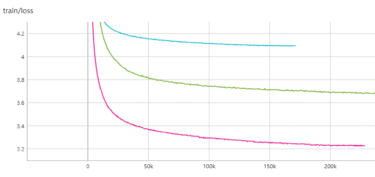

# Llama2 Torch

## 1.简介

本项目旨在构建一个小参数量的中文大语言模型，模型架构主要来自Llama2，包含：预训练 -> SFT指令微调。

注意：
1. 因本分支采用的模型为 PyTorch 形式模型，训练完 SFT 模型后，不支持 TRL，无法继续训练 RM 模型和 RL 模型；
2. 正在重新构建基础模型，采用Transformers库构建，计划后续支持MoE等，用于后续的强化学习部分；
3. 因资源限制，本项目第一要务是将大模型整个流程走通，而不是调教比较好的效果。

如果此项目对你有用，麻烦点一下 start，谢谢！

## 2.快速开始

暂时只上传了 58m 的微调模型，运行下面的代码，可直接下载。

如果程序下载困难，可到Hugging Face链接 [hf_tiny_llm_58m_sft](https://huggingface.co/wdndev/hf_tiny_llm_58m_sft)，下载全部的文件，放入本地目录中，更新`model_id`中的路径为本地目录，即可运行。

```python
from transformers import AutoModelForCausalLM, AutoTokenizer
import torch

model_id = "wdndev/hf_tiny_llm_58m_sft"
tokenizer = AutoTokenizer.from_pretrained(model_id, trust_remote_code=True) 
model = AutoModelForCausalLM.from_pretrained(model_id, device_map="auto", trust_remote_code=True)

# text = "介绍一下刘德华。"
# text = "请问，世界上最大的动物是什么？"
text = "中国的首都在什么地方？"

# 哎。。。，SFT时没有注意这个特殊的token，拼接了prompt和answer，使用HF时，词表中没有这个，，，难受
model_inputs_id = tokenizer.encode(text, add_special_tokens=False) + [tokenizer.special_tokens['<bos>']]
model_inputs_id = (torch.tensor(model_inputs_id, dtype=torch.long, device=model.device)[None, ...])
generated_ids = model.generate(model_inputs_id)
generated_ids = [
    output_ids[len(input_ids):] for input_ids, output_ids in zip(model_inputs_id, generated_ids)
]
response = tokenizer.batch_decode(generated_ids, skip_special_tokens=True)[0]

print(response)
```
生成效果
```bash
问：介绍一下刘德华。
答：刘德华是中国著名的演员、歌手、电影制片人、音乐制作人、演员和导演。他因创作的电影作品深受观众喜爱，并经常获得奥斯卡最佳男主角奖。

问：中国的首都在什么地方？
答：中国的首都在北京。

问：请问，世界上最大的动物是什么？
答：蓝鲸是世界上最大的动物。

```


## 3.模型

### 3.1 Tokenizer

LLM分词器的构建方式有两种：一种是自己构造词表，训练一个分词器；另一种是选择开源模型训练好的分词器。

由于Llama2官方提供的词表中，中文部分较少。本项目为了方便，选择 [ChatGLM3](https://huggingface.co/THUDM/chatglm3-6b) 的分词器，该词表大小为64793。

### 3.2 模型结构

模型结构和[karpathy/llama2.c](https://github.com/karpathy/llama2.c)中使用的一致，在此基础上添加了一些常用的功能，方便使用。


### 3.3 模型尺寸

模型结构未进行改动，只是将参数缩放，但因使用 [ChatGLM3](https://huggingface.co/THUDM/chatglm3-6b) 的分词器，模型的参数也随之发生变化，具体参数细节如下所示：

| model            | dim  | n_layers | n_heads | n_kv_heads | max context length | params | vocab size |
| ---------------- | ---- | -------- | ------- | ---------- | ------------------ | ------ | ---------- |
| tiny-llama2-9m   | 64   | 5        | 8       | 4          | 512                | 9M     | 64793      |
| tiny-llama2-24m  | 288  | 6        | 6       | 6          | 512                | 24M    | 64793      |
| tiny-llama2-58m  | 512  | 8        | 8       | 8          | 512                | 58M    | 64793      |
| tiny-llama2-134m | 768  | 12       | 12      | 12         | 512                | 134M   | 64793      |
| tiny-llama2-256m | 1024 | 16       | 16      | 16         | 1024               | 256M   | 64793      |
|  |  |  |  |  |  |  |  |


## 4.预训练

### 4.1 通用模型训练

#### （1）预训练预料

本次训练的预训练预料都来自[Hugging Face](https://huggingface.co/)，主要包含以下几个经典的中文数据集，大约有6B左右Token，详细数据集如下：

| 中文预训练语料    | 链接 | 描述                                            |
| ----------------- | ---- | ----------------------------------------------- |
| Wiki中文百科      |  [wikipedia](https://huggingface.co/datasets/pleisto/wikipedia-cn-20230720-filtered)    | 中文Wikipedia的数据                             |
| BaiduBaiKe        | [baidubaike](https://huggingface.co/datasets/xuqinyang/BaiduBaike-5.63M) | 中文BaiduBaiKe的数据                            |
| zhihu             | [zhihu](https://huggingface.co/datasets/wangrui6/Zhihu-KOL) | 知乎KOL中截取的数据                             |
| TigerBot 部分数据 | [tigerBot](https://huggingface.co/datasets/TigerResearch/pretrain_zh) | TigerBot 模型训练的部分中文数据，原始数据太多了 |
|                   |      |                                                 |

上述数据处理脚本为，在处理时，Tokenizer后保存为可直接训练的二进制文件(`.bin`)。

注意：此处使用 Numpy 的格式保存，不需要考虑每个 max_seq_len 的长度，使用Numpy保存尽可能压缩存储空间。后续的SFT执行微调数据和RM数据集是以哦那个 pickle 格式保存，主要 Numpy 不能保存不等长列表。

#### （2）预训练预料构建

读取预训练语料，使用 Tokenizer 编码之后，添加 `<eos>` 结束表示，保存至`*.bin`文件中，方便模型调用，Tokenizer代码如下所示，详细代码见 `utils`目录。

```python
def process_wiki_clean(file_path, tokenizer):
    with open(file_path, 'r', encoding='utf-8') as f:
        data = json.load(f)
    all_tokens = []
    for line in tqdm(data):
        text = line['completion']
        tokens = tokenizer.encode(text, add_special_tokens=False)
        tokens.append(tokenizer.special_tokens['<eos>'])
        if len(tokens) > 5:
            all_tokens += tokens
    arr = np.array(all_tokens, dtype=np.uint16)
    base_name, ext = os.path.splitext(file_path)
    output_file_path = base_name + '.bin'
    with open(output_file_path, 'wb') as f:
        f.write(arr.tobytes())
```

数据加载 `PretrainDataset`，这部分主要是 `inputs_ids` 和 `labels`的构造，`PretrainDataset`类输出方式和[karpathy/llama2.c](https://github.com/karpathy/llama2.c)项目加载方式类似，直接返回`X`和`Y`。因训练代码使用 Transformers库，在训练代码中，还需进一步处理。

```python
class PretrainDataset(Dataset):
    def __init__(self, data_path_list, max_length=256, memmap=False):
        super().__init__()
        # ...
    def __len__(self):
        return self.data.shape[0]
    def __getitem__(self, index: int):
        #
        sample = self.data[index]
        X=np.array(sample[:-1]).astype(np.int64)
        Y=np.array(sample[1:]).astype(np.int64)
        
        return torch.from_numpy(X), torch.from_numpy(Y)
```
训练部分处理
```python
def data_collator_fn(examples):
    # 将所有样本的输入 (`X`) 和标签 (`Y`) 分别堆叠
    input_ids = torch.stack([example[0] for example in examples])
    labels = torch.stack([example[1] for example in examples])

    # 返回一个字典，包含模型需要的键和值
    data_dict = {
        "input_ids": input_ids,
        "labels": labels
    }
    return data_dict
```

#### （3）预训练脚本

Python训练脚本见 `pre_train.py`文件所示。

训练启动脚本见 `script/ptm_demo.sh`所示。该启动脚本，支持多机多卡训练，支持ZeRO优化；只需修改部分参数，就可以训练不同尺寸，适应不同机器的训练。如果使用训练，主要修改的部分如下：

```bash
# 常见参数修改，根据自己机器修改
N_NODES=2
N_GPUS=8
RANK=0
MASTER_ADDR="11.73.240.171"
MASTER_PORT=1234

# 单卡bs， 根据自己机器修改
MBS=2 

# 训练精度
DS_DTYPE="fp16" # [fp16, bf16]
# 是否加载模型继续训练，注意，若没有checkpoint，指定为True会报错
RESUME="False"

# 训练类型，ptm不用指定 BASE_MODEL_PATH 参数，其他类型需要
MODE="ptm" # [ptm, sft, rm, rl]
# 训练数据文件夹
DATASET_DIR="data/pre_train/baidubaike"
BASE_MODEL_PATH="test"

# 模型尺寸
MODEL_SIZE="24m" # [9m, 24m, 58m, 134m, 268m]

```

其他地方，根据自己需要修改，大部分不需要修改。


#### （4）Loss曲线

训练方式为：预训练19B的Token，全部过 2 个epoch后停止，没有早停。

因在不同机器训练，batch_size不同，横轴显示步数，所有曲线结束不一致，但全部都是按照上述训练结束。


最终 Loss 对比，还是要将模型做大，才能出来好一点的效果。

| model            | end loss  |
| ---------------- | ---- |
| tiny-llama2-9m   | 4.372   |
| tiny-llama2-24m  | 4.016  |
| tiny-llama2-58m  | 3.538  |
| tiny-llama2-134m | 3.127  |
| tiny-llama2-256m | 2.919 |
|                   |      |

#### （5）预训练 Base 模型续写效果

##### Pytorch方式加载

模型测试见 `eval.py`，启动脚本位于 `script/eval.sh`，对于不同的模型，只需修改部分参数，即可运行。

```python
# 示例1 ：床前明月光，疑是地上霜。举头望明月，
tiny-llama2-9m response:  下水半时，白手拈，大叫，在雪中。若用冰定冰，冰断冰，雪冻冰，再冰定水，雪冻冰，时雪凉冰。
tiny-llama2-24m response: 明月斜照人间。明月西望天，高瞻远瞩海。
tiny-llama2-58m response: 看明月时，天光自照。 玉带风轻舞，红楼翠袖。夜宿金门宿，夜归玉带生。
tiny-llama2-134m response: 低头想故乡。野草不生我独长：语出《诗经·邶风·野草》。草即野草。野草生不得长，野草又枯死，因而有野草的遗恨，故称。
tiny-llama2-268m response: 低头思故乡。

# 示例2 : 《小王子》是一本畅销童话书，它讲述了：
tiny-llama2-9m response: 在世界里，爱慕着，美丽和幸福。这本书让读者能够对美丽和幸福、幸福和梦想融为一体的故事，对美好、幸福、幸福的更美的诠释。《中国爱慕文化》的最后一页，是每个爱人的情感寄托，是人生创造人生的永恒。
tiny-llama2-24m response: 男孩的爸爸、爸爸和爷爷，他从小就把各种东西都叫做“小王子”。
tiny-llama2-58m response: 小王子在一天之内在不同的森林里长大。一天里，他遇到一条小路，并把他带到森林中去。原来，他的小路是一个被森林包围的荒滩，那里有很多树木，他们想把它卖出去，可是又因为森林被森林封闭而陷入沉睡的状态。为了阻止森林里的邪恶，小王子决定在森林里种植一些花草，希望他能在森林中有更多的生命，于是便用大块花草种植了森林里的邪恶小怪
tiny-llama2-134m response: 在父亲去世后，小王子被送到了一个名为阿格丽丝的小岛，在那里她的朋友遇到了坏心的父亲，但是阿格丽丝却说她要跟坏女人过日子…… 《小王子》将带你进入一个魔幻世界，这里有令人迷醉的城堡、有令人恐惧的野兽、有令人恐怖的野兽、有让人充满智慧的城堡、有令人恐惧的野兽。
tiny-llama2-268m response: 小王子从天空中掉下来，落在小羊城堡的地下，王子发现这里住着一个不速之客，他想要和王子结婚，却被拒绝后，又发现这里住着一个坏家伙，于是，王子决心除掉坏家伙。
```

##### Hugging Face方式加载

加载代码
```python
from transformers import AutoModelForCausalLM, AutoTokenizer

model_id = "wdndev/tiny_llama2_58m"
tokenizer = AutoTokenizer.from_pretrained(model_id, trust_remote_code=True) 
model = AutoModelForCausalLM.from_pretrained(model_id, device_map="auto", trust_remote_code=True)

text = "床前明月光，疑是地上霜。举头望明月，"

model_inputs = tokenizer(text, return_tensors="pt").to(model.device)
generated_ids = model.generate(model_inputs.input_ids)
generated_ids = [
    output_ids for input_ids, output_ids in zip(model_inputs.input_ids, generated_ids)
]
response = tokenizer.batch_decode(generated_ids, skip_special_tokens=True)[0]
print(response)
```

效果展示
```python
# 示例1 ：床前明月光，疑是地上霜。举头望明月，
tiny-llama2-9m response:  一跃而上。
tiny-llama2-24m response: 心如花烛。
tiny-llama2-58m response: 望见山峦。此行欲往东，此路须更往。
tiny-llama2-134m response: 疑是天上星。
tiny-llama2-268m response: 低头思故乡。
```

### 4.2 网络小说模型训练

收集网络小说约9000本，经过清洗，去重，大约剩余37G文本左右，使用 [ChatGLM3](https://huggingface.co/THUDM/chatglm3-6b)  Tokenizer后，大约有 `9B` 的Token，具体网络小说数据集已上传 Hugging Face （[wdndev/webnovel-chinese · Datasets at Hugging Face](https://huggingface.co/datasets/wdndev/webnovel-chinese)）。

使用网络小说数据集，训练`tiny-llama2-24m`和`tiny-llama2-58m`这两个规格的模型，训练脚本 。。

#### （1）训练预料构建

预训练语料要经过清洗后，才能使用。在此项目中，主要对网络小说中的广告进行了清洗。清洗过后的语料，进行 Tokenizer 处理后，就可以送给大模型训练了。

数据集构建和加载方式和4.1节一样，后续不再赘述了。

```python
def process_webnovel(input_dir, tokenizer):
    for subdir, dirs, files in os.walk(input_dir):
        for idx, file in enumerate(files):
            # 只处理txt文件
            if file.endswith('.jsonl'):
                # 获取当前文件的绝对路径
                file_path = os.path.join(subdir, file)
                all_tokens = []
                # 读取jsonl文件
                with open(file_path, 'r', encoding='utf-8') as infile:
                    lines = infile.readlines()
                    
                for line in tqdm(lines):
                    json_obj = json.loads(line)  # 解析json字符串为python对象
                    text = json_obj['text']
                    tokens = tokenizer.encode(text, add_special_tokens=False)
                    tokens.append(tokenizer.special_tokens['<eos>'])
                    if len(tokens) > 5:
                        all_tokens += tokens
    
                arr = np.array(all_tokens, dtype = np.uint16)
                base_name, ext = os.path.splitext(file_path)
                output_file_path = base_name + '.bin'
                with open(output_file_path, 'wb') as f:
                    f.write(arr.tobytes())
```

#### （2）预训练脚本

预训练脚本和启动脚本与4.1节展示相同，只是将训练语料的来源和输出文件夹进行修改即可。

```bash
# 数据
MODE="ptm" # [ptm, sft, rm, rlhf]
DATASET_DIR="data/pre_train/webnovel"
BASE_MODEL_PATH="test"

MODEL_SIZE="24M" # [9M, 24M, 58M, 134M]
MODEL_NAME="${MODE}_tiny_llama2_webnovel_${MODEL_SIZE}_test"
OUTPUT_DIR="outputs/ckpt/${MODEL_NAME}_epoch${TRAIN_EPOCHS}"
```

#### （3）Loss曲线

训练方式为：网络小说9B的Token，全部过 3 个epoch后停止，没有早停。

因在不同机器训练，batch_size不同，横轴显示步数，所有曲线结束不一致，但全部都是按照上述训练结束。

训练Loss曲线如下所示：



| model            | end loss  |
| ---------------- | ---- |
| tiny-llama2-webnovel-24m  | 4.093  |
| tiny-llama2-webnovel-58m  | 3.67  |
| tiny-llama2-webnovel-134m | 3.229  |
|                   |      |

#### （4）模型续写效果

##### Pytorch方式加载

```python
# 示例1 : 三十年河东，三十年河西，莫欺少年穷，
tiny-llama2-webnovel-24m response:  而如今，这番番番的言语，更是牵扯到了他自己的切身利益。
tiny-llama2-webnovel-58m response: 这已经是他们一生都无法回想起来的事情了。
tiny-llama2-webnovel-134m response: 天底下哪里有那么便宜的事情。

# 示例2 : 人生如棋，落子无悔，
tiny-llama2-webnovel-24m response:  一生归宿，从此不许再见到她，这世上最美好的事物，也只有它能包容，但，她绝没有这样的，哪怕她再怎么温柔，也永远都忘不了的。她永远无法忘掉。
tiny-llama2-webnovel-58m response: 我一生追求道，却一直无法真正地踏出这一步，那便是天意。
tiny-llama2-webnovel-134m response: 棋盘之上所牵绊的东西，都是不可逾越的鸿沟，没有人能够逾越。

# 示例3 : 彼岸花开开彼岸，断肠草愁愁断肠，奈何桥前可奈何，
tiny-llama2-webnovel-24m response: 路途遥远，根本走不出路。
tiny-llama2-webnovel-58m response: 只盼此花开不尽，枯竭一空！
tiny-llama2-webnovel-134m response: 望花落如梦……

```

##### Hugging Face方式加载

加载代码
```python
from transformers import AutoModelForCausalLM, AutoTokenizer

model_id = "wdndev/tiny_llama2_webnovel_58m"
tokenizer = AutoTokenizer.from_pretrained(model_id, trust_remote_code=True) 
model = AutoModelForCausalLM.from_pretrained(model_id, device_map="auto", trust_remote_code=True)

text = "三十年河东，三十年河西，莫欺少年穷，"

model_inputs = tokenizer(text, return_tensors="pt").to(model.device)
generated_ids = model.generate(model_inputs.input_ids)
generated_ids = [
    output_ids for input_ids, output_ids in zip(model_inputs.input_ids, generated_ids)
]
response = tokenizer.batch_decode(generated_ids, skip_special_tokens=True)[0]
print(response)
```

效果展示

```python
# 示例1 : 三十年河东，三十年河西，莫欺少年穷，
hf-tiny-llama2-webnovel-24m response: 不许与这等大世家为敌。
hf-tiny-llama2-webnovel-58m response: 以武学闻名，我大明军队中，最出名的就是兵法。
hf-tiny-llama2-webnovel-134m response: 这话说的真够直白的。

# 示例2 : 人生如棋，落子无悔，
hf-tiny-llama2-webnovel-24m response: 却不知该何去何从。
hf-tiny-llama2-webnovel-58m response: 因为棋力、棋技、天赋等等因素的缘故，而往往可以获得最优秀的人才。
hf-tiny-llama2-webnovel-134m response: 心无旁骛，无欲无求，心神宁静，心如明镜。

```

## 5.SFT指令微调

SFT：训练一个拥有基础对话能力的模型

SFT指令微调在通用预训练模型上进行，即在 `base`模型上进行。

### 5.1 SFT指令微调预料

SFT指令微调预料都来自[Hugging Face](https://huggingface.co/)，主要包含以下几个经典的SFT数据集，大约有400w条，详细数据集如下：

| SFT微调数据    | 链接 | 描述                                            |
| ----------------- | ---- | ----------------------------------------------- |
| Belle     |  [Belle](https://huggingface.co/datasets/BelleGroup/train_2M_CN)  | 包含约200万条由BELLE项目生成的中文指令数据|
| Firefly | [Firefly](https://huggingface.co/datasets/YeungNLP/firefly-train-1.1M) | 流萤开源模型SFT数据集 |                     |
| TigerBot | [tigerBot](https://huggingface.co/datasets/TigerResearch/sft_zh) | TigerBot 模型SFT数据集 |
|                   |      |                                                 |

### 5.2 SFT指令微调预料构建

SFT指令构建格式为 : `question + <bos> + answer + <eos>`，因为SFT微调数据量较小，可以在加载数据集时做tokenizer。

部分处理数据处理如下所示，先将数据保存为二进制文件

```python
def process_bell_2m(file_path, tokenizer):
    """ https://huggingface.co/datasets/BelleGroup/train_2M_CN
    """

    token_ids = []
    with open(file_path, 'r', encoding='utf-8') as infile:
        lines = infile.readlines()
    for line in tqdm(lines):
        json_obj = json.loads(line)  # 解析json字符串为python对象
        
        instruction = json_obj["instruction"]
        input_str = json_obj["input"]
        answer = json_obj["output"]
        
        question = instruction + input_str
        
        if len(question) < 10 and len(answer) < 1:
            continue
        
        prompt_id = tokenizer.encode(question, add_special_tokens=False)
        answer_id = tokenizer.encode(answer, add_special_tokens=False)
        
        text_id = prompt_id + [tokenizer.special_tokens['<bos>']] + answer_id + [tokenizer.special_tokens['<eos>']]

        if len(text_id) > 5:
            token_ids.append(text_id)
        
    return token_ids
```

数据加载 `SFTDataset`，这部分主要是 `inputs_ids` 和 `labels`的构造，`SFTDataset`类输出方式和[DLLXW/baby-llama2-chinese](https://github.com/DLLXW/baby-llama2-chinese)项目加载方式类似，直接返回`X`、`Y`和`loss_mask`。因训练代码使用 Transformers库，在训练代码中，还需进一步处理。

`loss_mask`作用：在SFT时，`question + <bos> + answer + <eos>`中只有 `answer`计算loss，其他不用计算loss，所以一种方式是使用`loss_mask`，屏蔽不需要计算loss的部分

```python
class SFTDataset(Dataset):
    def __init__(self, data_path_list, max_length=256, tokenizer=None):
        self.data = []
        # ...
        
    def __len__(self):
        return len(self.data)
    
    def __getitem__(self, index : int):
        input_id = self.data[index]
        # ...
        
        input_id = np.array(input_id)
        X = np.array(input_id[:-1]).astype(np.int64)
        Y = np.array(input_id[1:]).astype(np.int64)
        loss_mask = np.array(loss_mask[:-1])
        #
        return torch.from_numpy(X), torch.from_numpy(Y), torch.from_numpy(loss_mask)
```

训练部分数据处理

```python
def data_collator_fn(examples):
    # 将所有样本的输入 (`X`) 和标签 (`Y`) 分别堆叠
    input_ids = torch.stack([example[0] for example in examples])
    labels = torch.stack([example[1] for example in examples])
    loss_mask = torch.stack([example[2] for example in examples])

    # 返回一个字典，包含模型需要的键和值
    data_dict = {
        "input_ids": input_ids,
        "labels": labels,
        "loss_mask": loss_mask
    }
    return data_dict
```

### 5.3 SFT指令微调脚本

Python训练脚本见 `sft_train.py`文件所示，与预训练不同的是loss的计算，需要重载loss计算函数，具体代码如下所示。

```python
class SFTTrainer(Trainer):
    def compute_loss(self, model, inputs, return_outputs=False):
        # print("loss inputs: ", inputs)
        X = inputs["input_ids"]
        Y = inputs["labels"]
        loss_mask = inputs["loss_mask"]
        outputs = model(X, Y)
        logits = outputs.get("logits")
        loss = nn.functional.cross_entropy(logits.view(-1, logits.size(-1)), Y.view(-1), ignore_index=0,reduce=False)
        loss_mask = loss_mask.view(-1)
        loss = torch.sum(loss * loss_mask) / loss_mask.sum()
        if return_outputs:
            return (loss, logits)
        return loss
```

训练启动脚本见 `script/sft_demo.sh`所示。该启动脚本，支持多机多卡训练，支持ZeRO优化；只需修改部分参数，就可以训练不同尺寸，适应不同机器的训练。如果使用训练，主要修改的部分如下：

```bash
# 常见参数修改，根据自己机器修改
N_NODES=2
N_GPUS=8
RANK=0
MASTER_ADDR="11.73.240.171"
MASTER_PORT=1234

# 单卡bs， 根据自己机器修改
MBS=2 

# 训练精度
DS_DTYPE="fp16" # [fp16, bf16]
# 是否加载模型继续训练，注意，若没有checkpoint，指定为True会报错
RESUME="False"

# 训练类型，ptm不用指定 BASE_MODEL_PATH 参数，其他类型需要
MODE="sft" # [ptm, sft, rm, rl]
# 训练数据文件夹
DATASET_DIR="data/pre_train/baidubaike"
BASE_MODEL_PATH="/wangdongnian/personal/tiny-llama2.zh/outputs/ckpt/ptm_tiny_llama2_24m_epoch3/checkpoint-1010000/pytorch_model.bin"

# 模型尺寸
MODEL_SIZE="24m" # [9m, 24m, 58m, 134m, 268m]

```

其他地方，根据自己需要修改，大部分不需要修改。

### 5.4 SFT指令微调Loss曲线

训练方式为：所有SFT训练数据，全部过 2 个epoch后停止，没有早停。

因在不同机器训练，batch_size不同，横轴显示步数，所有曲线结束不一致，但全部都是按照上述训练结束。


最终Loss对比

| model            | end loss  |
| ---------------- | ---- |
| tiny-llama2-9m   | 2.77   |
| tiny-llama2-24m  | 2.466 |
| tiny-llama2-58m  | 2.081  |
| tiny-llama2-134m | 1.824  |
| tiny-llama2-256m | 1.644 |
|                   |      |

### 5.5  微调 SFT 模型对话效果


#### （1）Pytorch方式加载

模型测试见 `eval.py`，启动脚本位于 `script/eval.sh`，对于不同的模型，只需修改部分参数，即可运行。


#### （2）Hugging Face方式加载

如果程序下载困难，可到Hugging Face链接 [hf_tiny_llm_58m_sft](https://huggingface.co/wdndev/hf_tiny_llm_58m_sft)，下载全部的文件，放入本地目录中，更新`model_id`中的路径为本地目录，即可运行。

```python
from transformers import AutoModelForCausalLM, AutoTokenizer
import torch

model_id = "wdndev/hf_tiny_llm_58m_sft"
tokenizer = AutoTokenizer.from_pretrained(model_id, trust_remote_code=True) 
model = AutoModelForCausalLM.from_pretrained(model_id, device_map="auto", trust_remote_code=True)

# text = "介绍一下刘德华。"
# text = "请问，世界上最大的动物是什么？"
text = "中国的首都在什么地方？"

# 哎。。。，SFT时没有注意这个特殊的token，拼接了prompt和answer，使用HF时，词表中没有这个，，，难受
model_inputs_id = tokenizer.encode(text, add_special_tokens=False) + [tokenizer.special_tokens['<bos>']]
model_inputs_id = (torch.tensor(model_inputs_id, dtype=torch.long, device=model.device)[None, ...])
generated_ids = model.generate(model_inputs_id)
generated_ids = [
    output_ids[len(input_ids):] for input_ids, output_ids in zip(model_inputs_id, generated_ids)
]
response = tokenizer.batch_decode(generated_ids, skip_special_tokens=True)[0]

print(response)
```
生成效果
```bash
问：介绍一下刘德华。
答：刘德华是中国著名的演员、歌手、电影制片人、音乐制作人、演员和导演。他因创作的电影作品深受观众喜爱，并经常获得奥斯卡最佳男主角奖。

问：中国的首都在什么地方？
答：中国的首都在北京。

问：请问，世界上最大的动物是什么？
答：蓝鲸是世界上最大的动物。
```


## 6.鸣谢

感谢下面这些开源项目，本项目实现有不少地方参考各个项目。

- [karpathy/llama2.c: Inference Llama 2 in one file of pure C ](https://github.com/karpathy/llama2.c)
- [DLLXW/baby-llama2-chinese](https://github.com/DLLXW/baby-llama2-chinese)
- [AI-Study-Han/Mini-Llama2-Chinese](https://github.com/AI-Study-Han/Mini-Llama2-Chinese)
- [Tongjilibo/build_MiniLLM_from_scratch](https://github.com/Tongjilibo/build_MiniLLM_from_scratch?tab=readme-ov-file)

